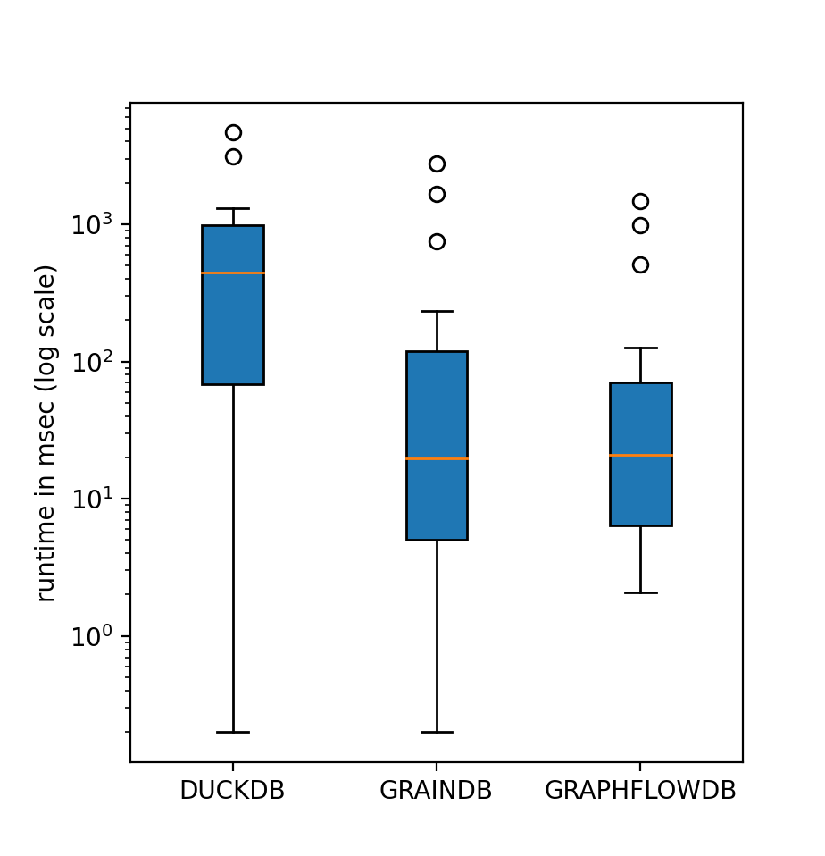

This is an initial beta release of GRainDB: a new system that extends the RDBMS ([DuckDB](https://github.com/duckdb/duckdb)) to provide graph modeling, querying, and visualization capabilities.
In addition, GRainDB modifies the internals of DuckDB to provide a set of fast join capabilities, such as predefined pointer-based joins that use system-level record IDs (RID) and adjacency list-like RID indices, to make DuckDB more efficient on graph workloads.

To understand our internals better, we refer readers to our accepted papers on GRainDB:
- [Making RDBMSs Efficient on Graph Workloads Through Predefined Joins](https://arxiv.org/pdf/2108.10540.pdf). PVLDB 2022.
- [GRainDB: A Relational-core Graph-Relational DBMS](https://cs.uwaterloo.ca/~ssalihog/papers/graindb-demo.pdf). CIDR 2022.

### Performance Benefits of GRainDB
Our evaluations of GRainDB on LDBC SNB showed that, by integrating predefined joins, GRainDB can outperform vanilla DuckDB, and closed the performance gap with [GraphflowDB](http://graphflow.io), a specialized GDBMS.



To run our evaluations, please visit our [github repo](https://github.com/graindb/graindb), and follow our instructions to download the source code and dataset.
After compilation, simply run the following command to get our performance benefits.
```shell
> ./build/release/benchmark/benchmark_runner "LDBC_LIGHT_OPTIMIZED_Q[0-9][0-9][0-9].*" --out=snb_evaluation.out
```

Please visit our papers for lots of more detailed evaluation results, and interesting findings!

### Demonstration of GRainDB
We provide a specialized [demonstration repo](https://github.com/graindb/graindb-demonstration), in which users can give a try on our graph modeling and visualization capabilities on top of a RDBMS.

### Talks
- [LDBC Fourteenth TUC Meeting](https://ldbcouncil.org/event/fourteenth-tuc-meeting/)

[](https://youtu.be/FFK3y6vPHJs)

- Our presentation at [CIDR 2022](http://cidrdb.org/cidr2022/program.html) is coming soon.

### Contact
Please feel free to submit any bug reports as issues and contact me with any questions, feedback or suggestions: guod.jin@gmail.com